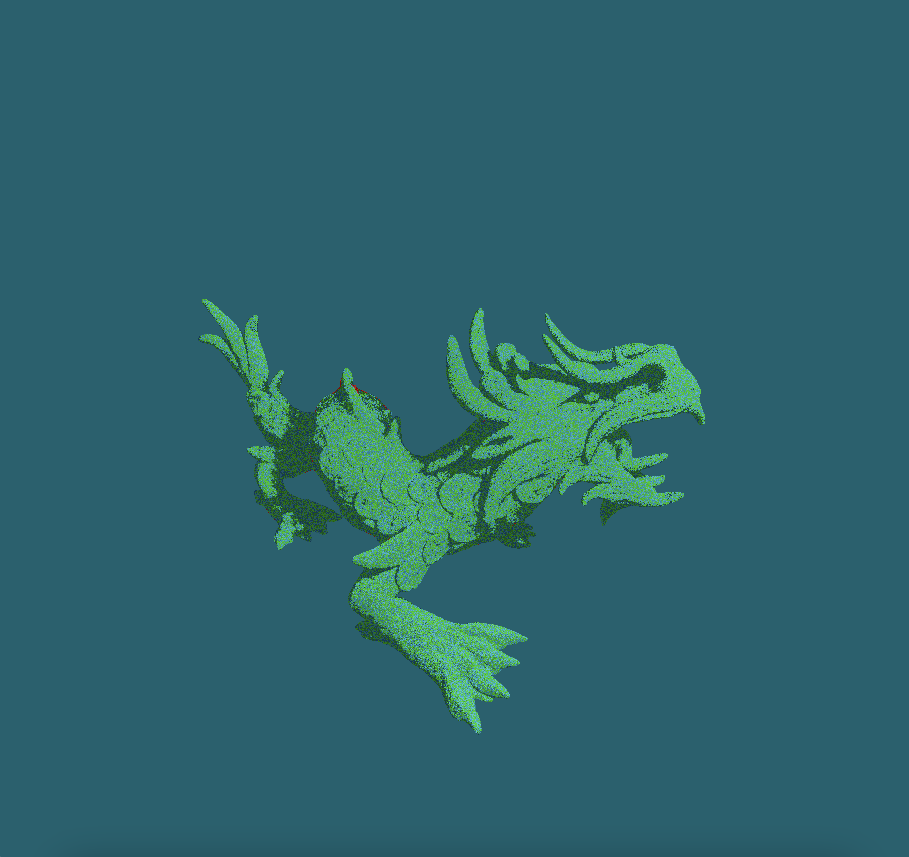
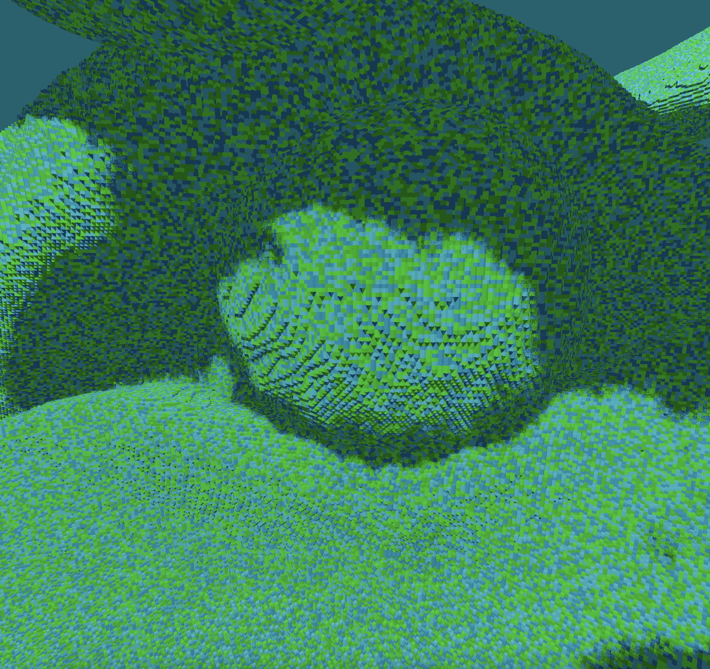
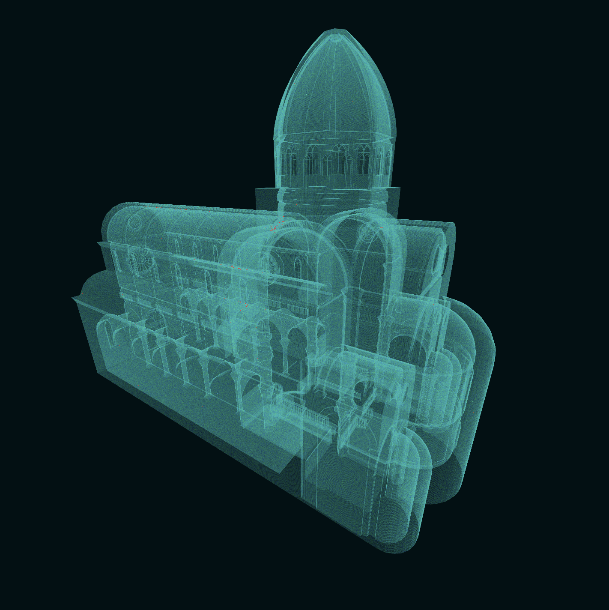

# Rust/Vulkan Ray Tracing Playground

## Screenshots

### Dragon

### Transperancy

## Controls

Forward: W\
Back: S\
Right: D\
Left: A

Up: Space\
Down: Shift

Speed up/slow down: Scroll Wheel

Toggle shadows: O\
Reprojection: P

## Settings

You can change the file and octree depth at the top of [main.rs](src/main.rs).

## Compiling

This project requires cargo (rust) to be compiled and run. You can get it from [here](https://doc.rust-lang.org/cargo/getting-started/installation.html). To compile the project run `cargo build --release` in this directory.

Everything is cross platfrom except for shaderc so make sure to go through [here](https://github.com/vulkano-rs/vulkano#setup-and-troubleshooting) to get shaderc working on your platform.

## Sources

Most of the rust code is taken from the [Vulkano Examples](https://github.com/vulkano-rs/vulkano-examples) triangle demo. I used it for basic rendering and I used the basic compute shader demo for the SSBO. This project relies on:

 - [winit](https://github.com/rust-windowing/winit)
 - [vulkano](https://github.com/vulkano-rs/vulkano)
 - [winit input helper](https://github.com/rukai/winit_input_helper)
 - [nalgebra](https://github.com/dimforge/nalgebra)

## Datastructures

I have documented my datastructures [here](DATASTRUCTURES.md)
